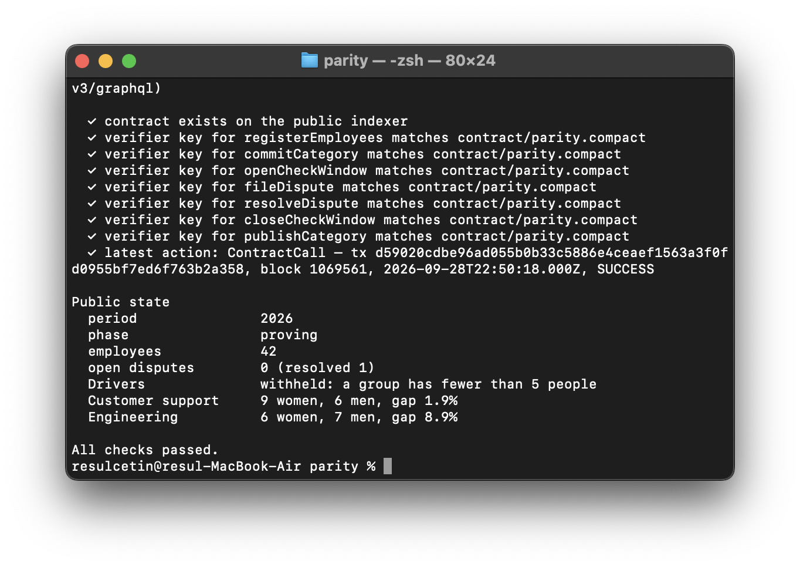

# Parity

**Pay gaps, proven.** Parity lets an employer publish a gender pay-gap report that employees can verify, without revealing anyone's salary. It is built on Midnight.

[](https://github.com/resulcetin09/Parity/actions/workflows/ci.yml)

> **Status: prototype.** Parity runs on Midnight Preview, a test network, and has not been audited. All figures shown without a live contract come from a fictional employer, Halden & Roe, and are labelled as samples.

**Live app:** https://parity-roan.vercel.app · [the deployed report on Preview](https://parity-roan.vercel.app/#/report?c=d5b5dcd1eb5b283488820ab2e71061ccf6715fc7a1ddfc8e7c6af1d9b0e2304c)

Rise In, New Moon to Full, Level 3.

## Deployed contract

| | |
| --- | --- |
| Network | Midnight **Preview** |
| Live report | https://parity-roan.vercel.app/#/report?c=d5b5dcd1eb5b283488820ab2e71061ccf6715fc7a1ddfc8e7c6af1d9b0e2304c |
| Contract address | `d5b5dcd1eb5b283488820ab2e71061ccf6715fc7a1ddfc8e7c6af1d9b0e2304c` |
| Report | Halden & Roe (fictional), period 2026: 42 employees registered, 3 categories committed |
| Dispute | 1 anonymous dispute filed (tx `007d8c09…a68fa0`, block 1,069,464) and resolved |
| Result | Engineering 8.9% gap (6 women, 7 men). Customer support 1.9% (9 women, 6 men). Drivers **withheld** by the circuit (3 women) |
| Last transaction | `d59020cdbe96ad055b0b33c5886e4ceaef1563a3f0fd0955bf7ed6f763b2a358`, block 1,069,561, `SUCCESS` |
| Evidence | [`deployments/preview.json`](deployments/preview.json). Re-check with `npm run verify:preview` |



Every step ran through the app with Lace on Preview:

1. deploy;
2. three batches of employee registrations;
3. three category commitments;
4. opening the check window;
5. an employee's on-device check and anonymous dispute;
6. resolving it;
7. closing the window;
8. three category proofs.

The on-chain verifier keys of all seven circuits match `contract/parity.compact`.

## The problem

The EU Pay Transparency Directive (2023/970) had to be transposed by 7 June 2026. Employers with 150 or more workers publish their first gender pay-gap report by June 2027. If an unexplained gap of 5% or more is not fixed within six months, a joint pay assessment with worker representatives follows.

But the report is computed by the employer, from data only the employer sees. Employees cannot check it without every salary being disclosed, which privacy law and the Directive's own small-group protection forbid. The most consequential number in the process is unverifiable by the people it protects.

## How Parity works

A report is one contract and runs in three cues:

1. **Commit.** HR commits each category's payroll as the root of a 16-slot Merkle tree of salted records `{present, woman, pay, salt}`. HR also registers an anonymous credential for each employee, 16 per transaction.
2. **Check.** Each employee opens their packet (their own record plus its path to the root) and recomputes the root on their device. If the record is wrong, they file an anonymous dispute. The dispute proves they hold a registered credential, and a per-report nullifier limits it to one per employee. HR sees which field is disputed, not who disputed it.
3. **Prove.** With no dispute open, HR proves each category. The circuit recomputes the committed root from the private records, counts and sums pay by gender, and publishes only the totals. If fewer than 5 women or 5 men are in the category, only the decision to withhold is published.

Every rule is an `assert` inside a Compact circuit, so it is part of the proof and a modified client cannot skip it:

| Rule | Circuit |
| --- | --- |
| Only HR can register employees, commit payroll, open or close the window, resolve disputes and prove | `requireOrganizer()`, knowledge of the secret behind `organizer` |
| Published figures come from exactly the committed records | `publishCategory`: `payrollRoot(records) == payroll[category]` |
| No group under 5 people is published; its counts and sums never leave the circuit | `publishCategory`: `disclose(women >= 5 && men >= 5)` |
| Only registered employees can dispute, once per report, without revealing who they are | `fileDispute`: private Merkle path bound to the caller's secret, plus a nullifier |
| No report while a dispute is open; the payroll is frozen once proving starts | `closeCheckWindow`, `commitCategory` |
| Lifecycle `committing → checking → proving`, with no way back | `openCheckWindow`, `closeCheckWindow` |

## Privacy model

**Public:** the report period, HR's commitment, each category's payroll root, the number of registered employees, disputes (nullifier and disputed field), and each published category's head count and pay totals by gender.

**Private:** every individual salary, which employee is in which slot, employee credentials, and who filed a dispute.

**Known limits, stated openly:**

- *Totals are public by design.* For a published category, total pay by gender is public, and averages follow from it.
- *Differencing across periods.* Comparing two reports can reveal the pay of someone who joined or left between them. A production system needs noise or minimum-change rules across periods.
- *Commitments cover what HR puts in them.* Parity proves the report matches the committed payroll. Whether the committed payroll matches reality depends on employees checking their records. That is why checking and disputing are built in.
- *HR issues the credentials.* In this prototype HR generates each employee's credential, so HR could compute dispute nullifiers. In production, employees should create their own credential and give HR only the commitment.
- *Category size.* One proof covers up to 16 people per category. Larger categories need more slots per proof or several proofs per category.
- *Metadata.* The wallet paying a transaction fee, and its timing, are visible on-chain.

The app refuses a remote proof server, so salaries and secrets are only ever sent to `localhost`.

## Run it

Node.js 24 (`.nvmrc`), macOS or Linux.

```sh
npm ci
npm run setup:compact   # Compact 0.31.1, SHA-256 verified
npm run compile         # circuits, bindings and proving keys
npm run dev             # http://127.0.0.1:5173
```

The landing page and the sample report work without a wallet. To run a real report on Preview:

1. Install [Lace](https://www.lace.io/) with Midnight support, select **Preview**, and get tNIGHT from the [Preview faucet](https://faucet.preview.midnight.network/). Generate tDUST for fees.
2. Run `docker compose up -d` to start `proof-server:8.1.0` on `127.0.0.1:6300`, and select it in Lace as the local proof server.
3. Open **For HR**, keep the sample payroll or load a CSV (`employee,category,gender,pay`), and choose **Create report on Midnight**. Save the organizer file.
4. Register employees, commit each category, download packets, open the check window.
5. Open **For employees** with a packet to check a record and file a dispute.
6. Resolve disputes, close the window and prove each category. The public report reads everything from the indexer.

## Verify a deployment

```sh
npm run inspect:preview -- <contract address> --save
npm run verify:preview
```

`inspect` checks against the public Preview indexer, with no wallet:

- the contract exists;
- the verifier key of each of the 7 circuits matches `contract/parity.compact`;
- the latest transaction and its block.

It prints the report's public state and writes `deployments/preview.json`. `verify` re-checks that file, and CI runs it on every push once the file is committed.

## Tests

```sh
npm test           # 28 tests: 19 Compact runtime tests + 9 app tests
npm run test:e2e   # 18 browser tests (desktop and mobile), including axe WCAG A/AA
npm run check      # compile, typecheck, unit tests, build
```

The contract tests run the circuits generated by `compactc` through the Compact runtime and cover:

- **A proven report:** exact totals, withholding a small group with nothing leaked, tampered records rejected, double and uncommitted publishing rejected.
- **Disputes:** proving blocked until disputes are resolved, one dispute per employee, non-employees rejected, a malicious witness reusing another employee's path rejected, corrections during the window, and the transcript not revealing the secret or credential.
- **Authorization:** every HR action rejected without the organizer secret, and duplicate registration rejected within and across batches.
- **Lifecycle:** every invalid transition rejected.
- **Self-check:** inclusion proofs and salting.

Mutation checks were run by hand: lowering the 5-person threshold turns the withholding test red.

## Pinned toolchain

Compact 0.31.1 · compact-runtime 0.16.0 · compact-js 2.5.1 · ledger-v8 8.1.0 · Midnight.js 4.1.1 · DApp connector API 4.0.1 · proof-server 8.1.0. npm versions are exact and the lockfile is committed. Compiler output in `contract/managed/parity/` is committed; compilation is deterministic, and CI fails if a fresh compile differs from it.

## Layout

```text
contract/parity.compact   the contract
src/contract/witnesses.ts private-state witnesses
src/lib/payroll.ts        salted 16-slot categories, roots, inclusion proofs, figures
src/lib/midnight.ts       Lace providers, deploy, calls, indexer reads
src/lib/files.ts          organizer file and employee packet formats
src/pages/                landing, report, HR console, employee check
cli/                      inspect and verify against the public indexer
design/                   the approved design canvas (Claude Design export)
tests/  e2e/              contract, app and browser tests
```

## Design

A black stage, two follow spots and one spike mark. The men's average reaches the equal-pay mark, and the women's beam stops short by the gap, marked in chalk. Type is Big Shoulders Display and Hanken Grotesk. The design was made in Claude Design and is kept in [`design/`](design/). Motion is one beam switch-on per page and is disabled for reduced motion.

## License

Apache-2.0
